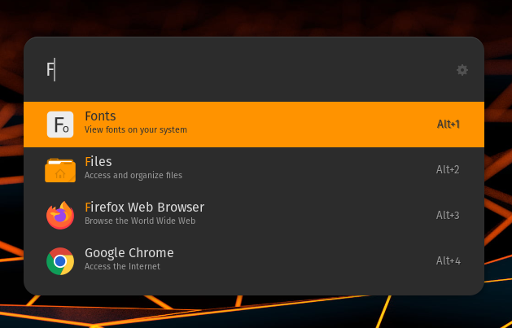

# Ulauncher Orchis Orange Dark

Ulauncher Template with orange accent color.



## 📥 Installation

1. Download latest version from [Release](https://github.com/Ni-g-3l/ulauncher-orchis-orange-dark/releases)
2. Extract it
3. Enter folder and run ```make install```

## 🤹 Authors / Contributers / Attributions

* **Ni-g-3l** - *Main Developer* - [Github](https://github.com/Ni-g-3l/)

See also the list of [contributors](https://github.com/Ni-g-3l/ulauncher-orchis-orange-dark/contributors) who participated in this project.

## 📃 License

This project is licensed under the MIT License - see the [LICENSE](LICENSE) file for details.

## 👏 Acknowledgments

* **Billie Thompson** - *README & Contribution Templates* - [PurpleBooth](https://github.com/PurpleBooth)
* **Kleber Swf** - *Base theme* - [Orchis Dark Ulauncher](https://github.com/kleber-swf/orchis-dark-ulauncher)
